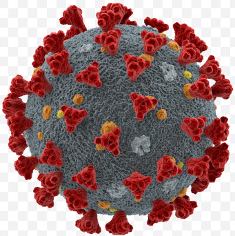

# covid-19-telegram-bot

[]()


The bot shows up-to-date status about COVID-19 cases. Enter the country name in Latin and get up-to-date statistics.
* [Bot Link](t.me/cv19_corona_virus_bot)


## Stack
* Telegram API
* [covid19-api](https://covid-193.p.rapidapi.com)
* [telegraf](https://www.npmjs.com/package/telegraf)
* [dotenv](https://www.npmjs.com/package/dotenv)
* [axios](https://www.npmjs.com/package/axios)
* [country-emoji](https://www.npmjs.com/package/country-emoji)
* [nodemon](https://nodemon.io/)


### Installation

COVID19 requires [Node.js](https://nodejs.org/) v12+ to run.

Install the dependencies and devDependencies and start the server.

```sh
$ cd covid-19-telegram-bot
$ npm install
$ npm start
```